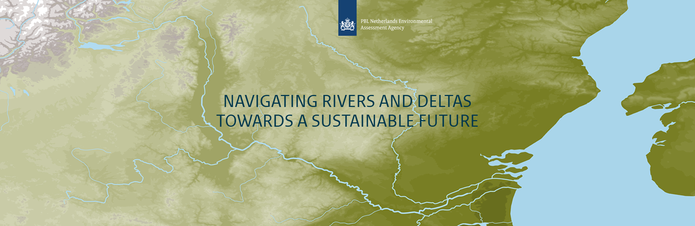

# Future water challenges in deltas

The River Basin & Delta Tool by PBL provides an overview of the current and future challenges in deltas, we encourage you to explore this tool through the link below:

<!-- For now we link to it with a button like the one below. In the future we might take over from PBL or link interactively -->

<a href="https://themasites.pbl.nl/future-water-challenges/river-basin-delta-tool/" target="_blank" style="text-decoration:none;">
    

      <button style="background-color:#0078D7; color:white; border:none; padding:10px 20px; border-radius:6px; cursor:pointer; font-size:16px;">
        Open the River Basin & Delta Tool
      </button>
    

</a>

<!-- PBL blocks embeddings, hence iframes do not work.. -->
<!-- <iframe 
    src="https://themasites.pbl.nl/future-water-challenges/river-basin-delta-tool" 
    width="100%" 
    height="600"
    style="border:1px solid #ccc; border-radius:8px;">
</iframe> -->
