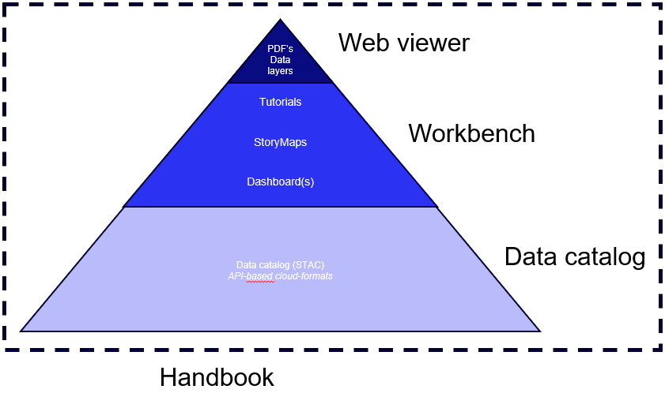

# The framework
The IDP framework consist of multiple layers, each targetting different users (levels of expertise) and serving different needs. All layers are combined and wrapped together in this handbook, which allows to provide more contextual information and additional explanations on when to use what and how to access it, as well as to bring all tools together.

## The data catalog
The [**data catalog**](https://radiantearth.github.io/stac-browser/#/external/storage.googleapis.com/gca-data-public/gca/gca-stac-4/catalog.json), a SpatioTemporal Asset Catalog (STAC), contains a lot of (climate) datasets. All these datasets are stored in the cloud, in so-called *cloud-native* data formats like Zarr, Parquet and / or Cloud Optimized GeoTIFF. The STAC allows our data to be stored in FAIR (Findable, Accessible, Interoperable & Reusable) way and integrates with the Deltares Data Management Suite (DMS). More information on the data catalog is present in the [**IDP data catalog**](../datasets/idp-stac-catalog) section. 

## The workbench
The [**workbench**](https://github.com/Deltares-research/IDP-workbench) allows the user with different levels of expertises to explore our (regional) data. Through intuitive ArcGIS storymaps we disclose analyses of various datasets with contextual information. Dashboards allow the user to interactively engage with the some of the data, to explore different "what-if" scenarios or to unveil hotspots. For more experienced / scientific users we provide a coding evironment with tutorials on how to use the datasets in *impact assessment workflows*, we also provide general guidelines on how to access the different datasets in data catalog. 

## The web viewer
The [**web viewer**](https://delta-portal.netlify.app/), contains a subset of the most interesting and state-of-the-art global data, yet it is only the tip of the iceberg with respect to what is present in the data catalog. It can be used to explore the applicability of the data layers and to inspire (non-experienced) stakeholders. Various standardized analysis tools are incorporated, like the possibility to get a cross-section of the data by drawing a transect or the option to analyse data, export data or download an automatically constructed PDF with AI-generated high level information on the area when drawing a polygon.  

