# Data ingestion manual
This manual functions to inform users about the process of making datasets CF compliant and merging them into a Spatio-Temporal Asset Catalog (STAC). It involves quite some dataset dependent time-consuming data engineering, although it is envisaged to make the process itself as straightforward as possible. In the near future we will lower the threshold by connecting with the [Deltares Data Management Suite](https://datasuite.deltares.nl/). Here, you will also find guidance selecting an appropriate (cloud) storage location for your (FAIR) data.

Before diving into the data delivery workflow, some background information on STAC and CF compliancy is presented. After the data delivery workflow, a way to keep track of the progress, future vision on the topics described in this manual and the software environment are outlined.  

The manual is drafted as part of a European Union H2020 project called Coastal Climate Core Services (CoCliCo, 2021-2025), from which it is using templates and workflows. Please reach out to the writers in case anything is unclear, broken or not usable anymore.  

For using a STAC as data handling tool (for instance for visualization or other post-processing), see the tutorials in this handbook or please visit the ‘Remote Sensing Data Handling using Python’ course on the [ET Sharepoint](https://deltares.sharepoint.com/sites/E-Learning/SitePages/Python-Programming-for-Earth-Observation-Data.aspx). Indicative course material and scripts are available on [GitHub](https://github.com/Deltares-research/py-sense).   

## Background information
The sections below discuss the background of the two core topics of this manual, the STAC and CF compliancy. Both help to format and structure data as such that it becomes inherently Findable, Accessible, Interoperable and Re-usable (FAIR, Wilkinson et al., 2016).   

### STAC 
At its core, the [STAC](https://stacspec.org/en) provides a common structure for describing and cataloging spatiotemporal assets. In other words, it is a family of specifications for the standardization of geospatial asset metadata structuring (for searching purposes) and data querying following a widely used API. Here, a ‘spatiotemporal asset’ is any file that represents information about the Earth at a certain location and time. The specification consists of four semi-independent parts which can be used alone but work best in conjunction with one another; item, catalog, collection and API.  

- Item: a GeoJSON Feature (single spatiotemporal asset) with a well-defined set of additional metadata (non-spatial characteristics like units, time and links). 
- Catalog: flexible JSON file with links providing a structure to organize and browse items. It can be supplemented by additional metadata as well. 
- Collection: extension of the catalog with additional information (metadata) such as extents, license, keywords, providers, etc. describing items falling in the collection.  
- API: provides a RESTful endpoint that enables searching of items, catalogs and collections, following OGC (WFS 3) standards related to the FAIR data principles. 

A STAC is static whenever the files (datasets) contained in it are stored in local directories, on file servers or in cloud services and are pre-cooked (i.e. are not constructed dynamically / on-the-fly). The STAC allows to disseminate the results through a cloud native data repository, which offers various advantages such as performance, reliability, cost-effectiveness and reproducibility (Abernathey et al., 2021). A few pros for using the STAC as core for a platform architecture are (as per Pangeo.io): 

- It allows to show / query data from other servers (interoperability); 
- Has a consistent API to approach (cloud-native) data; 
- Diminishes the need to build an API yourself (Abernathey et al., 2021); 
- Is very robust and easily scalable; 
- Could be used dynamically to read data in a certain area or timespan very efficiently; 
- Enables data-proximate computing; 
- Could directly be used as ‘back-end’ for front-end applications;  
- Is currently being used by many prominent parties in the industry like Google, NASA, USGS, Planet & Microsoft.  

The give an idea, the CoCliCo STAC catalog can be viewed nicely in [Radiant Earth](https://radiantearth.github.io/stac-browser/#/) by inserting the cloud bucket URL ‘https://storage.googleapis.com/coclico-data-public/coclico/coclico-stac/catalog.json’. Inserting ‘https://planetarycomputer.microsoft.com/api/stac/v1’ shows nicely what Microsoft has built for its Planetary Computer STAC.  

### CF compliancy 
The [CF metadata conventions](https://cfconventions.org/conventions.html) allow for generic and definitive descriptions of what data variables represent, enabling users of data from different sources to decide which quantities are comparable and facilitates building applications (front-ends) with powerful extraction, re-gridding and displaying capabilities. 

CF is developed through open discussion on GitHub. The CF community embraces a philosophy of producing excellence by maintaining an open and welcoming culture and an environment that promotes debate and inquiry in a respectful, bold and intellectually rigorous fashion. Initially, CF was developed for gridded data from Climate and Forecasting models (hence “CF”) of the atmosphere and ocean, but its use has subsequently extended to other geosciences, and to observations as well as numerical models. The use of CF is recommended where applicable by Unidata.  

## Data delivery workflow
Depending on the dataset characteristics, we have developed a workflow of (Python) scripts to merge datasets into a STAC. The below-described three-step workflow is visualized bewlow. In all these scripts, generic Extract, Transform and Load (ETL) functionality from [GitHub](https://github.com/openearth/coclicodata/tree/main/src/coclicodata/etl) is imported to ease the process. However, we first need to get our software environment up and running before we can use the workflow. Please see Chapter 7 on troubleshooting for help on some well-known errors. 

For working with the scripts provided in this manual, it is required to install the mambaforge package manager (for information on general Mamba capabilities, see [here](https://mamba.readthedocs.io/en/latest/installation.html)). Download the executable from [MiniForge](https://github.com/conda-forge/miniforge#mambaforge) for your Operating System. Once this is installed, open a Miniforge Prompt (terminal). After cloning the [coclicodata GitHub repo](https://github.com/openearth/coclicodata) on your local desktop, you can navigate to it in the Miniforge Prompt and run ‘mamba env create -f environment.yml’. This may take a few minutes to complete but once it is finished you will have all required packages installed in your ‘coclico’ environment. Use this environment for to access all functionalities presented in this manual. For a more detailed explanation on Git, Mamba and software environments, please visit [this GitHub repo](https://github.com/Deltares/py-sense/tree/main).  

The first step in the workflow is rather arbitrary and differs a lot per dataset. This focuses on converting the dataset into the correct format while also complying with the CF conventions for variables & metadata. The data types that can be handled are spatial data like feature / vector, structured raster / image and unstructured grid data as well as temporal data like regular and irregular timeseries data, or a combination of both. Depending on the data characteristics, it is best captured in different data formats. Three different, cloud-optimized data formats that can be used to store raster and vector data as well as datacube’s are: [Zarr](https://zarr.readthedocs.io/en/stable/getting_started.html); time-series / multidimensional array’s, [Parquet](https://arrow.apache.org/docs/python/parquet.html); tabular / vector data and [Cloud Optimized Geotiffs](https://www.cogeo.org/) or COG(s); raster data. These can be accessed using HTTP get requests, from various types of servers, typically by using a filesystem specification mapper. More conventional data formats include GeoJSON and NetCDF, which can be used for other cloud services or unstructured files respectively.  

The second step rather small but generic. The main aim here to check the formatted file (in case this was done by a different institute / partner) and to upload it to a dedicated cloud storage account (could be Google Cloud, Amazon WebService S3, Azure or else). Additionally, the file can be converted to a flat GeoJSON (with certain set variables) for hosting specific geospatial layers as map service through for instance MapBox or Google Earth Engine (GEE). It also contains some functionality to upload this data to these cloud services.  

The third step finally merges all information from step one and two into a STAC, which is nothing more than a structured JSON file with links to where the data is stored plus some additional metadata information. The template of this STAC (collection) is already pre-specified. The only arbitrary input here relates to some dataset characteristics like file names, variables, dimensions to ignore, the front-end plot axes, etc. 

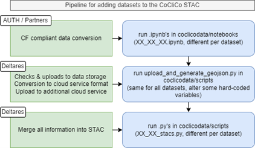 
  

In the sections below, each of the above-described steps will be further detailed for an example dataset called Extreme Sea Level at different Global Warming Levels (ESLbyGWL). This dataset was published by Tebaldi et al. (2021) and is accessed [here](https://doi.org/10.1038/s41558-021-01127-1). Originally, this data comes in 25 separate CSV files which are stored on a P drive available at: ‘p:\11208003-latedeo2022\020_InternationalDeltaPortfolio\datasets\04_extreme_sea_levels_at_different_global_warming_levels\’. Scripts for adding the dataset to the STAC can be found here for each of the three steps:

1.	https://github.com/openearth/global-coastal-atlas/tree/main/STAC/data/notebooks/08_ESLbyGWL.ipynb 
2.	https://github.com/openearth/global-coastal-atlas/tree/main/STAC/data/scripts/upload_and_generate_geojson.py
3.	https://github.com/openearth/global-coastal-atlas/tree/main/STAC/data/scripts/08_ESLbyGWL_stacs.py

Note, this example considers the workflow for a Zarr format dataset. A lot of other examples for converting datasets following the steps described above are present within the CoCliCo and GlobalCoastalAtlas GitHub repositories available [here](https://github.com/openearth/coclicodata) and [here](https://github.com/openearth/global-coastal-atlas/tree/main/STAC/data) (see for instance example file names from the table below). These repositories also contain scripts for Parquet and CoG formats, with slight differences in the procedure. For instance, for CoGs step 2 is skipped. This is because we do not need an additional cloud service (MapBox) to show the data. The data is uploaded to the cloud in step 3 instead. For Zarr, the difficulty in step 1 is the CF compliancy as well as the formatting because of the degrees of freedom. For CoGs, the difficulty is not necessarily the CF compliancy (because it is less flexible in terms of variables & structure) but more about the chunking of the data. The same holds for Parquet, where chunking is also the most challenging. Note, for Parquet and CoG we use functionality from the coastmonitor GH package. Install it in your env by running in your anaconda / mamba prompt: pip install –e ., from the cloned path from coastmonitor. 

| Data type                              | Data format | Example dataset                     |
|----------------------------------------|--------------|-------------------------------------|
| Spatial & timeseries vector            | Zarr         | Coclicodata – ssl, eesl             |
| Spatial vector (tabular)               | Parquet      | Coclicodata – ceed                  |
| Spatial raster (chunked)               | CoG(s)       | Coclicodata – coastal-mask          |
| Spatial & timeseries raster            | CoG(s)       | Coclicodata – slp5, slp6 & cfhp     |
| Timeseries raster                      | CoG(s)       | Coclicodata – pp                    |
| Unstructured spatial raster            | –            | –                                   |
| Unstructured spatial & timeseries raster | –          | –                                   |

### CF compliant data conversion
When dealing with new datasets, it is advised to first get acquainted with the new dataset in an explorative environment like Jupyter Notebooks. Make a separate branch for adding this dataset to the STAC in the repository and ask yourself these questions: 
1.	Does the dataset have metadata variables?
2.	Are the (metadata) variables CF compliant? 
3.	Is the dataset structured logically?
4.	How does the spatial layer of the data look like? 
5.	Does the data have a temporal layer? If yes, how does this look like?

The dataset example in this manual looks like the following (for Bangladesh 100yr ESL, which is one of the 25 CSV files in the ESLbyGWL dataset):

 
  

The first three questions above deal with checking the CF compliancy and structure of the dataset shown above. To ease this process, we have written a [Python script](https://github.com/openearth/coclicodata/blob/main/src/coclicodata/etl/cf_compliancy_checker.py) that can be imported to check CF comliancy and to save log (.check) files. This script is a wrapper around the official [cf-checker](https://github.com/cedadev/cf-checker/tree/master) that is prescribed by the [CF conventions](https://cfconventions.org/software.html). For a snip of the log file of the ESLbyGWL dataset see the figure below, in total there are 0 errors, 17 warnings, and 14 information messages.
 
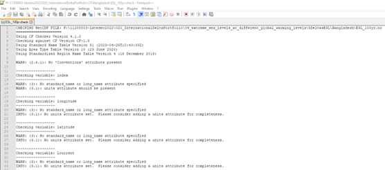 
  

The dataset has no metadata attributes (question 1). This makes it difficult to get a sense of the data characteristics, the provider and the license for instance. Hence, we would need to add these accordingly. Furthermore, the variables are not CF compliant (17 warnings and 14 information messages, question 2). It is good practice to solve the errors as well as the warnings and to get rid of most information messages. Also, the dataset isn’t structured logically (question 3) as every GWL has a different variable per ensemble (5-percentile, mean, 95-percentile) and the files are all split per region (Bangladesh, Mekong, etc.) and return period. Typically, we would merge all this information into one file with one convenient variable that has multiple dimensions. To summarize, we would need to provide metadata, make the file CF compliant and restructure the dataset.  

Starting with the metadata, every dataset comes with attributes / metadata at dataset level. A template for the attributes that are required is provided in [here](https://github.com/openearth/coclicodata/blob/main/metadata_template.json). This template needs to be filled in based on information retrieved from the paper [here](https://doi.org/10.1038/s41558-021-01127-1). See the result in ‘p:\11208003-latedeo2022\020_InternationalDeltaPortfolio\datasets\04_extreme_sea_levels_at_different_global_warming_levels\metadata_ESLbyGWL.json’.

Making the file CF compliant and restructuring is usually a simultaneous action and involves writing dedicated code to format the datasets properly. It might help to look up a few other examples to get started. Depending on what needs to be done (preferably by the data owner), this is the most time-consuming task. However, remember that hereafter you would never have to deal with any of the data engineering for this dataset for using it in different projects. 

Currently, a table with controlled vocabulary on CoCliCo (metadata) variables is hosted [here](https://github.com/openearth/coclicodata/blob/main/README.md). This table will be updated with every dataset that becomes available. Whenever a new dataset contains metadata not yet present in the controlled vocabulary table, it is advised to check the CF convention [standard name table](https://cfconventions.org/Data/cf-standard-names/current/build/cf-standard-name-table.html) and to add the metadata variable to the table on GitHub for future datasets to be incorporated in the platform.  Note that CF conventions are not complete. If the variable is not present in the CF standard name table, it is suggested to incorporate metadata conventions as suggested in (prioritized): [CMIP6](https://github.com/WCRP-CMIP/CMIP6_CVs), IPCC AR6 Glossary (IPCC, 2022), Gregory et al., 2019 or 2017 terminology of the United Nation Office for Disaster reduction. When in doubt, please contact the contributors this handbook or come up with a suitable (metadata) variable yourself. 

The result is a dataset which is CF compliant and self-explanatory (based on metadata attributes and variables). See figure below for an impression of this dataset. As can be seen, we merged the variables with separate ensembles, regions and return periods into one variable called ‘esl’ (extreme sea level). This variable is multi-dimensional and contains four global warming levels (gwl; current, 1.5 degrees, 3.0 degrees and 5.0 degrees), three ensembles (5th-percentile, mean and 95th-percentile), 230 stations (spread over all five deltas; Bangladesh, Mekong, Mississippi, Niger and North Sea Basin) and five return periods (5, 10, 20, 50 and 100 years). The dataset is saved as NetCDF file and can be accessed here: ‘p:\11208003-latedeo2022\020_InternationalDeltaPortfolio\datasets\04_extreme_sea_levels_at_different_global_warming_levels\5DeltasESL\ESLbyGWL_CF.nc’. The CF compliancy comes back blank, i.e. 0 errors, 0 warnings and 0 information messages and can be accessed here: ‘p:\11208003-latedeo2022\020_InternationalDeltaPortfolio\datasets\CF\5DeltasESL\ESLbyGWL_CF.check’.

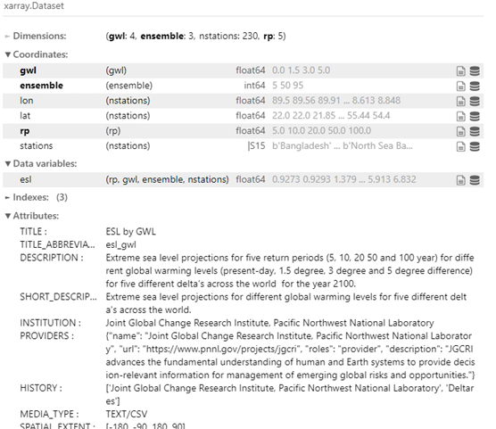 
  

The last two questions of the first paragraph in this section deal with the dataset format. The desired cloud-native dataset format is dependent on the data type, in other words, how the spatial and temporal layers within the datasets look like. The flow diagram in the figure below helps to determine to desired data format for the dataset. The example dataset contains points in its spatial layer (nstations; features / vectors). Hence, without temporal layer it would be formatted to a Parquet file. However, the RP dimension contains years and hence regular / irregular timesteps. This dataset would therefore be formatted into Zarr. 

The objective of STAC catalog is to facilitate data search by spatio-temporal extent. This was developed for satellite data, which typically have a specific timestamp related to the acquisition. However, at Deltares we use STAC for datasets that do not fit into this model, like average met-ocean conditions for a certain time range, or climate projections for a certain period in the future. Therefore, it is crucial to be very careful in how the time property in these situations is handled. Following the [best practices](https://github.com/radiantearth/stac-spec/blob/master/best-practices.md#stac-best-practices) it is recommended to add a ‘start_datetime’ and ’end_datetime’ in these cases. The general time property should however enable the data to show up in the right time. Sometimes averages are being used, but this is tricky as using 1950 as representative for 1900-2000 will make the item not show up when somebody searches for 1990 – 2000. When you encounter trouble in specifying the right datetime of a certain catalog, collection or item, please contact the writers of this manual for guidance. 

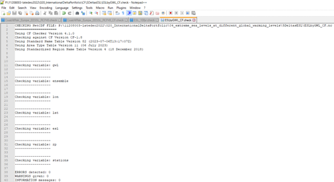 
  

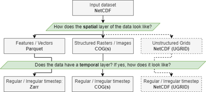 
  

The final result for the example in this section can be found here: ‘p:\11208003-latedeo2022\020_InternationalDeltaPortfolio\datasets\04_extreme_sea_levels_at_different_global_warming_levels\5DeltasESL\ESLbyGWL.zarr\’. Note that this a folder instead of a single file. A Zarr folder contains separate folders with dimensions, coordinates and variables of the dataset as seen in the figure above. Within these folders there are partitions of the actual dataset stored in numbered files. Besides, the attributes, metadata, group and array information are stored in hidden files. [Xarray](https://xarray.dev/) makes it easy to load Zarr folders into a single dataset again and has been used in the first script to restructure the dataset already. 

### Uploading to cloud storage (and additional cloud services)
The next step in the process is to check the CF compliant cloud-native file format (if needed), to upload this to a cloud bucket (Google in this case), to convert to an additional cloud service format (GeoJSON for instance) and to upload to an additional cloud service (like MapBox). This step is similar for all datasets and only involves changing some hard-coded input parameters. Hence, it is a single script (upload_and_generate_geojson.py) which is overwritten for every new dataset. It is good practice to commit your changes to GitHub by adding the dataset name to the commit message such that it is easy to find back what your hard-coded input parameters were. As an alternative, you might also look into the third script to get a sense of the hard-coded input parameters as these are similar. An example script for the data used in this manual is stored [here](https://github.com/openearth/global-coastal-atlas/blob/main/STAC/data/scripts/examples/upload_and_generate_geojson_ESLbyGWL.py) for the sake of simplicity. In the following paragraphs the steps in this script will be discussed separately, but first it is touched upon the necessary credentials.

For the script to work properly with a Google Cloud Bucket, you need to point to credentials for the Deltares Global Data Service - Public Data Store, which can be found in: ‘p:\11205479-coclico\FASTTRACK_DATA\google_credentials.json’. Please leave these here, we don’t want them to swing around multiple P drives. This is not a very safe solution as needs to be revised in the future. The script points to P-drive file with the specified ‘credentials_dir’ so this should all go well. 

The additional cloud service currently exploited is [MapBox](https://www.mapbox.com/), which provides many tools to build, style and customize maps into websites or web-based applications. Another cloud service not yet incorporated might be Google Earth Engine (for hosting CoGs). Deltares has a MapBox account for global data viewers where various layers from in-house web-applications can be accessed, the credentials can be obtained from the writers of this manual. We use MapBox’s API to upload files directly from Python scripts to their platform. This action requires an access token that needs to be in the .env file in the base of the directory you are using [ETL functionalities](https://github.com/openearth/coclicodata/tree/main/src/coclicodata/etl) from. An example of such a file is stored in the ‘.env.example’ in this folder. The actual file can be obtained from the writers of this manual and needs to be stored in your local clone of coclicodata (the same location where ‘.env.example’ is present). 

In the beginning of upload_and_generate_geojson.py file, you are required to specify some hard-coded input parameters like the Google Cloud project, the bucket and project name as well as the MapBox project. Please advise the writers of this manual if you are not sure about the storage locations. Besides this, you need to specify the cloud-native file format location and name. With all this information, the file can be checked (important in case we receive it from a third party) and uploaded to the storage bucket. See screenshot from the Google Cloud Bucket with the ESLbyGWL Zarr dataset below. 

 
  

The code that follows all deal with transforming the Zarr file into a file format MapBox can work with. MapBox uses GeoJSON files for this purpose. However, GeoJSON’s cannot deal with nested information and hence we need to flatten the information from the CF compliant Zarr file. The flattened GeoJSON spans up the parameter space that a user can view in a web platform. The resulting GeoJSON is shown below, saved on a P drive available at ‘p:\11208003-latedeo2022\020_InternationalDeltaPortfolio\datasets\04_extreme_sea_levels_at_different_global_warming_levels\5DeltasESL\platform\ESLbyGWL_esl.geojson’ and uploaded to MapBox. Note, the below figure shows a manually adjusted snip for indicative purposes only, the actual file is a single line to save space on the disk. In MapBox, the GeoJSON looks like the image below, where all possible map variations / combinations have a separate row with values connected to it. When clicking a point in the map, the exact values for this point show up similar as in the figure below. All points for a certain combination of parameters in the front-end of a platform will be retrieved from the STAC MapBox URL. MapBox contains many more options to style tilesets like this one nicely but this is not further detailed in this manual. We stick to the vector (point) layer shown in the image below for the sake of simplicity. If you have Python 3.10 or larger, the mapboxcli package does not work properly and requires a monkey patch in its installation. See the script itself for more details on how to make this monkey patch. 

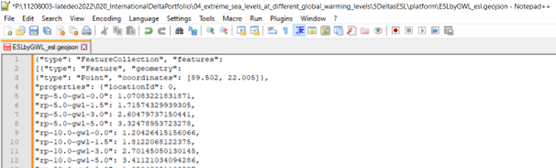 
  

 

### Describing the data in a STAC catalog
The final step is to merge all information into a STAC catalog. Overall, it is recommended to describe datasets in STAC collections and bundle these in a STAC catalog. For example, with CoCliCo we have a CoCliCO STAC catalog that contains several datasets (STAC Collections). Each of the collections have at least one STAC item which contains the metadata for that dataset-partition as well as the asset. For cataloging the data, we again have a dedicated script per dataset as we have to deal with different hard-coded input parameters (same as for the second step) and templates. At the moment, we have two layouts (STAC templates) created within CoCliCo: one for Zarr and one for CoG’s. Depending on the data format, a different layout is consulted to populate the STAC. In principle, most of the uptake is standardized by using STAC extensions that are maintained by the stac-utils community. It is key to use STAC extensions to describe the metadata properties for the catalog, collections and items as these are your warrant that the STAC catalog is valid. [Here](https://github.com/stac-extensions/stac-extensions.github.io) you can find a list of STAC extensions. Please note that you can also filter by maturity. The table below provides an overview of STAC extensions that we use in CoCliCo. 

| Extension         | Dataset type | Purpose                                                                 |
|-------------------|--------------|--------------------------------------------------------------------------|
| Item-assets       | all          | Asset description, like IONA media type                                 |
| projection        | all          | Specify CRS                                                             |
| raster            | CoG/Zarr     | Raster properties like resolution                                       |
| eo                | CoG/Zarr     | Band information                                                        |
| datacube          | Zarr         | Describe the dimension properties                                       |
| table             | (Geo)Parquet | Table properties, like column names and column data types               |
| File info         | all          | File info, like number of bytes                                         |
| Processing        | all          | Processing history                                                      |
| Versioning        | all          | Version indicator                                                       |
| Scientific        | all          | Scientific citation, like DOI                                           |
| Deltares-frontend | all          | Web-portal visualization properties, like hue                           |

At Deltares we use STAC catalogs as backend for data visualization in dedicated web portals. The main advantage is that we no longer have to develop specific API’s to query the data. However, it is now required to specify some front-end properties like color gradients, the types of plots, the color bar limits, the x and y-axes of graphs in the front-end.  To do so, we have developed a Deltares STAC extension following a set of best-practices described at [here](https://pystac.readthedocs.io/en/stable/tutorials/adding-new-and-custom-extensions.html). At this stage the Deltares STAC extension is maintained [here](https://github.com/openearth/coclicodata/blob/main/src/coclicodata/coclico_stac/extension.py). 

For the example (ESLbyGWL) dataset in this manual, the STAC is structured like the sequence of images that follows below. The main STAC folder (current) has a catalog.json file in which there is general metadata of the project present together with links (children) to the collections of individual datasets in the STAC. Each of these datasets has a separate folder. As can be seen, the ESLbyGWL dataset is identified as ‘esl_gwl’. Within the dataset folder, there is a collection.json file with all dataset-specific metadata and a link to the Zarr file that was stored in the Google Cloud bucket in step 2. This Zarr can be opened in a workbench environment for various post-processing routines (like visualizing of the data or correlating to other datasets). It can also be used to construct the graphs in a dashboard of the front-end application that runs directly on top of the STAC. Within the collection, there is another layer called ‘items’, this points to another file in the ‘esl-mapbox’ folder. The esl-mapbox folder has several files dedicated to the individual mapbox map items that can be specified in drop-down menus in a front-end. Each file represents the ESL values for a specific set of parameters as it points to the MapBox layer from step 2. Note, the hierarchy of this Zarr layout is similar for CoGs, yet, folder names might differ. 

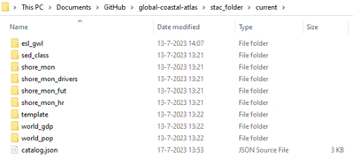 
 
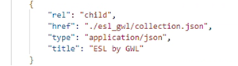 
   

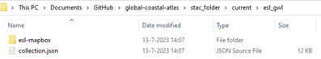 

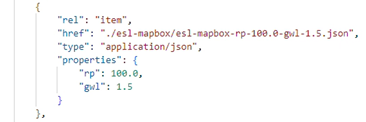 

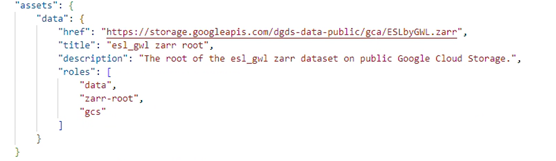 
   

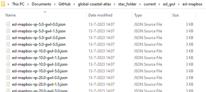 

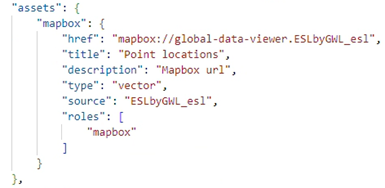 

### Extra steps
The steps described below can be used to advance the experience of working with a STAC but are not necessarily required. It depends on the requirements of the project whether these could be of use. Please contact the writers of this manual in case you want to take these into account.

#### Validating the STAC and uploading to the cloud
It is crucial to validate the STAC catalog before publishing it (to the cloud). Pystac provides a method to validate the STAC catalog, like `catalog.validate_all()`. This method validates whether all entries have satisfied the schema of the STAC extension. This is a warrant that the catalog is a valid static collection of JSON files. The script for validating the STAC and subsequently uploading it to the cloud can be found [here](https://github.com/openearth/global-coastal-atlas/blob/main/STAC/data/scripts/stac_to_cloud.py). 

#### Validating the merged dataset
To get insights into the end product, it is wise to write some dedicated code to check whether the STAC merged dataset could be loaded in correctly. This code can also be of use for others to indicate how to interpret / use the dataset you have been working on. For the example taken care of in this manual, the code can be found [here](https://github.com/openearth/global-coastal-atlas/blob/main/STAC/visualization/08_ESLbyGWL.ipynb). 

You can either use the local directory (i.e. the local clone of the project repo) or the cloud bucket URL (if the STAC is validated and published). By listing the children within the catalog, all the datasets within the current STAC project are visualized as seen in images above. The bottom one, `esl_gwl` is the dataset that was formatted in this manual. We can open it by retrieving the `href` of the dataset and using the `open_zarr` functionality of Xarray. The output should be similar as presented before, though the dimensions could be shuffled.

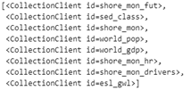 

Plotting the dataset helps to get insights into any discrepancies / errors in the data engineering steps that went ahead of getting the dataset into the STAC. The indicative plot as seen in the figure below can easily be adjusted by altering the location, global warming level and return period of the plot variables. At the same time, a visualization like the figure below can help front-end developers to get a sense of what needs to be displayed on the map / dashboard of a web-application.

 

## Roadmap
The ultimate goal for this initiative is to have a repo called ‘deltares-stactools’ in which Deltares maintains all its functionalities (ETL) for data FAIRification, the STAC collection and catalog templates as well as maintains its Deltares STAC extension that can be used by web-portals in their frontend visualization.  This repo will be converted to a standalone library, importable with a private package server (like private PyPi for Python, private npm for JavaScript or JFrog Artifactory for Java) to distribute the package to specific projects. The modules that are contained in the library should build upon well-established Python STAC libraries (See Section 6) and should not aim to replace them. It should be a generic data-wrangling library, that make use of Python STAC-tools packages to do high-level processing tasks related to how Deltares aims to use STAC for their data dissemination and frontend visualization. By adopting such a workflow, we only have to maintain the common / controlled vocabulary, while we benefit from Deltares broad STAC developments.  This vocabulary consists of a queried table from all related collections / datasets in different STAC projects. 

Adjustments to the functionality in ETL, templates or the Deltares STAC extension, should be made generically available in the ‘deltares-stactools’ package and unit-tested before merged. A list of projects that make use of / build a STAC can also be maintained in the ‘deltares-stactools’ package, just to get a quick overview of all the initiatives within Deltares that make use of it. This should also make it easy to search for examples when anyone is committing to making a dataset CF compliant and transforming it into the correct format.  

The non-standard, dataset related scripts will be in project-specific repo’s (like  for [CoCliCo](https://github.com/openearth/coclicodata) and [GCA and IDP](https://github.com/openearth/global-coastal-atlas). The STAC will also be built in these repos to keep them separated per project (to be used for instance as ‘back-end’ for web-viewers). In the repos it should be made clear where the initial datasets are stored (P-drives) as back-up. 

At the moment of writing this manual, the first steps for this vision are carried out. Yet, the core functionality of the STAC is still present [here](https://github.com/openearth/coclicodata) and not in a separate repo. Hence, the script functionalities from this repo are imported in other projects (GCA / DPF) by adding the user-dependent path (i.e. local clone of coclicodata) to the system variables.

## More details on the software environment
The software that is recommended for data FAIRification and describing that data in STAC catalogs are several Python packages. Working with STAC files is not limited to the Python programming language, but Python is an excellent tool for data wrangling and much of the STAC developments are written in Python. The software environment that is used for data wrangling, generation of STAC catalogs, interacting with cloud services and data exploration is provided in [here](https://github.com/openearth/coclicodata/blob/main/environment.yml). The process for building STAC catalogs can roughly be divided into the 1) FAIRification of data; 2) describing these FAIR datasets in STAC catalogs; 3) data exploration. Each of these three components requires different software packages (see figure below). The first two pillars in the figure below (FAIRification and Coastal data STAC) link to the three-step workflow presented in the first figure of this manual (Section 3.1, 3.2 and 3.3 as well as 3.4.1). The last pillar in the figure (data exploration) relates to Section 3.4.2. 

For the FAIRification of data (1) and describing those in STAC catalogs (2) it is recommended to use the stactools modules where possible. The methods in this library for ETL tasks are generally supported by the Xarray and GeoPandas data models. The library can be found [here](https://github.com/stac-utils/stactools), and is maintained by the stac-utils community. The STAC packages [here](https://github.com/stactools-packages) provide excellent examples of how the modules can be used to process data and describe these in STAC catalogs. To search the STAC catalog (3) it is recommended to use either psytac or pystac-client – both are maintained by the stac-utils community. The pystac-client provides more advanced functionalities,such as search by query, but that also requires that the STAC catalog has been built with those advanced capabiliities enabled. The data is typically stored in cloud-optimized data formats, so it is generaly convenient to interect with these using a Dask backend. To load the STAC items into the Xarray data model it is recommended to use ODC-stac, stackstac or xpystac. When the data is hold as an Xarray object it is straightforward to do data visualization using the Holoviz data visualization ecosystem.  To work with large collections of STAC items that refer geoparquet files it is reocmmended to use geoparquet-items. 

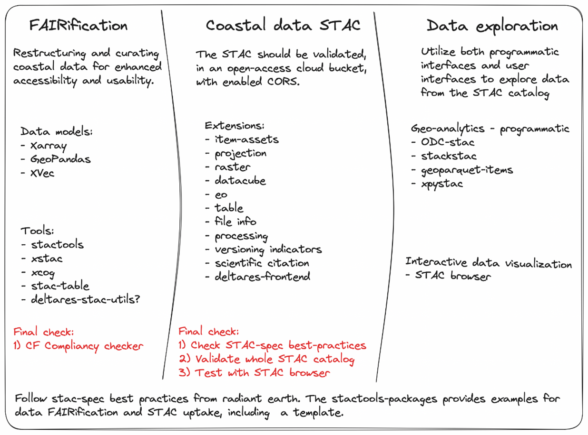 

## Troubleshooting
1.	An assertion error in ‘check_compliancy’ is usually related to UDUNITS2. Note that we hard-code the UDUNITS_XML_PATH in the second cell of the script as work-around for the Windows OS incompatibility. Please check if you have this file in the Anaconda / Mamba packages folder and refer to it correctly. If not, you will get it from us from p:\11207608-coclico\FASTTRACK_DATA\XX_UDUNITS2\ to put in the packages folder. 
2.	“'mapbox' is not recognized as an internal or external command, operable program or batch file.”. Please open a Miniforge or Anaconda Prompt, activate the environment, cd to the folder and open Jupyter Lab or VS code from there and rerun the code. It should work now.
3.	“ImportError: cannot import name 'Mapping' from 'collections'”. Please click on the last script that is mentioned in the error, something like ‘mapbox/utils.py’ and change ‘from collections import …’ to ‘from collections.abc import …’ and save the changes. 
4.	“Extension 'CoclicoExtension' is not implemented on object.STAC producers can add the extension using ``CoclicoExtension.add_to(obj)``”. This has to do with a new update of pystac (1.9.0). Version 1.8.2 works out fine. Please downgrade to 1.8.2 with ‘mamba install pystac==1.8.2’ for the moment in Miniforge prompt.
5.	Validation error pystac & jsonschema
6.	If the STAC browser does not show the STAC catalog due to CORS header issues. Try setting the bucket CORS headers. Open cloud shell terminal in the Google cloud console and enter ‘touch cors_config.json’, ‘edit cors_config.json’, put in the list ‘[{"maxAgeSeconds": 3600, "method": ["*"], "origin": ["*"], "responseHeader": ["*"]}]’ and set ‘gsutil cors set cors_config.json gs://dgds-data-public’. Check it with: ‘gsutil cors get gs://orelse-data-public’. 

## References
Abernathey, R.P., et al., 2021. "Cloud-native repositories for big scientific data." Computing in Science & Engineering 23.2. https://doi.org/10.1109/MCSE.2021.3059437 

Gregory, J.M., Griffies, S.M., Hughes, C.W., et al., 2019. Concepts and Terminology for Sea  Level: Mean, Variability and Change, Both Local and Global. Surv Geophys 40, 1251–1289. https://doi.org/10.1007/s10712-019-09525-z

IPCC, 2022. Glossary (Annex 2) of the IPCC WGII 6th Assessment Report  https://www.ipcc.ch/report/ar6/wg2/downloads/report/
IPCC_AR6_WGII_Annex-II.pdf

Tebaldi, C., Ranasinghe, R., Vousdoukas, M. et al. Extreme sea levels at different global warming levels. Nat. Clim. Chang. 11, 746–751 (2021). https://doi.org/10.1038/s41558-021-01127-1

UNISDR, 2017: United Nation Office for Disaster Reduction – Terminology. https://www.undrr.org/terminology

Wilkinson, M., Dumontier, M., Aalbersberg, I. et al., 2016. The FAIR Guiding Principles for scientific data management and stewardship. Sci Data 3, 160018. https://doi.org/10.1038/sdata.2016.18
