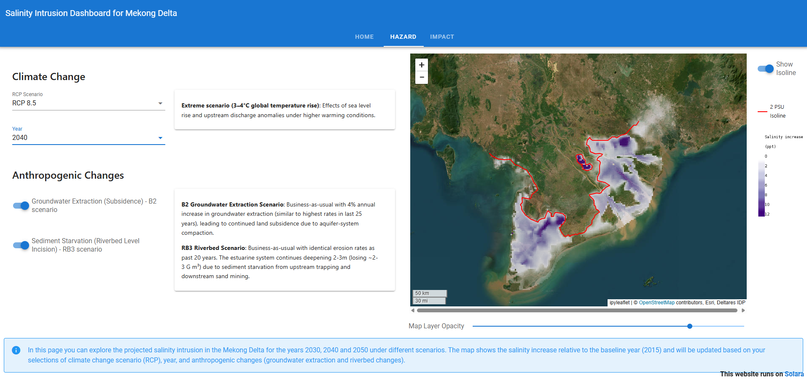

# Mekong Delta Salinity Intrusion Scenarios Dashboard

This dashboard explores future salinity intrusion scenarios in the Mekong Delta. The underlying data and scenarios are based on the study:

**"Projections of salt intrusion in a mega-delta under climatic and anthropogenic stressors"** ([Nature Communications Earth & Environment, 2021](https://www.nature.com/articles/s43247-021-00208-5)).

This study combines climate projections, groundwater extraction, and riverbed erosion scenarios to assess salinity intrusion for the next three decades. The dashboard allows the user to interactively explore these scenarios and their impacts.

## Drivers & Scenarios considered:
- **Climate Change:** RCP 4.5 and RCP 8.5 climate scenarios accounting for the effects of *sea level rise* and *upstream discharge* anomalies under different warming conditions.
- **Groundwater Extraction:** Two Groundwater extraction scenarios that drive *land subsidence*. One describes a reduced extraction scenario (M2) and one a business-as-usual scenario (B2).
- **Sediment Starvation:** Two scenarios for sediment supply and resulting *riverbed level changes*. One scenario assumes reduced erosion rates (RB1) while the other scribes a business-as-usual case (RB3).

To provide a range of possible futures, these drivers are combined into a total of 6 scenarios for the years **2030, 2040, and 2050**. The scenarios are combined in order to have a worst-case and best-case scenario for each combination.
The combinations that are considered are:

- **Climate Change only** : RCP 4.5 and RCP 8.5.
- **Climate Change + Groundwater Extraction** : RCP 4.5 + M2 and RCP 8.5 + B2.
- **Climate Change + Groundwater Extraction + Sediment Starvation** : RCP 4.5 + M2 + RB1 and RCP 8.5 + B2 + RB3.

## Dashboard 
The dashboard was built using [Solara](https://solara.dev/) and has two main components:

- **Hazard:** View and compare salinity intrusion maps for different scenario combinations. Adjust climate, subsidence, and riverbed settings to see their effects on the delta. 



- **Impact:** Assess the consequences for for agriculture production of rice based on different scenarios. For the impact the results are only available for 2050 and the worst-case combinations (RCP 8.5, B2 and RB3)


You can access the dashboard [here](https://solara1.avi.directory.intra/).

```{admonition} Disclaimer
:class: warning

The link for the dashboard is hosted on an internal server and may not be accessible from outside the Deltares organization.
```
