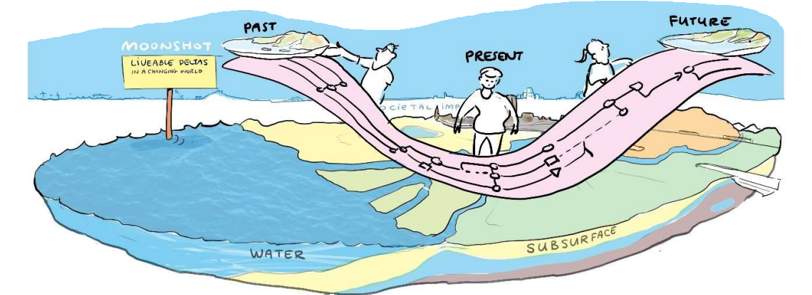

# Welcome to the International Delta Platform Handbook

The International Delta Platform (IDP) is a project which falls under Moonshot 1, Livable Deltas in a changing world, in the Deltares SITO program. Within this project, we have developed a framework that allows stakeholder engagement using different tools; with the ultimate goal to utilize robust, evidence-based data to pinpoint and address critical shifts in our deltas in the past, the present and in the future. By enabling such a climate service that combines climate data, information and knowledge we aid in the decision-making practice. 

## How to use this Handbook
loremipsum...
